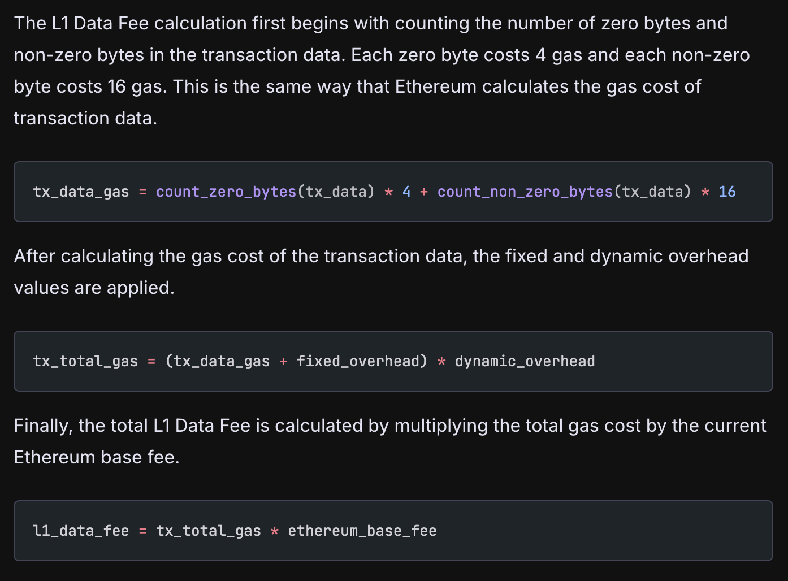

# Bruce Xu

## 自我介绍

大家好，我是 Bruce，对 OP 非常感兴趣，然后希望可以通过这次共学，系统性的理解和认识一下 Optimism 的生态和相关信息知识等。

我的推特 <https://x.com/brucexu_eth> 欢迎关注。

## 你认为你会完成本次残酷学习吗？

那必须的

## Notes

<!-- Content_START -->

### 2025.01.06

#### Layer2 扩容方案: https://docs.optimism.io/stack/rollup/overview

TODO OP Stack Specification https://specs.optimism.io/

TODO Bedrock 是什么？

目前 OP 的 L2 Blocks 存放在 https://etherscan.io/address/0xff00000000000000000000000000000000000010 这个地址的 blob 上面。提交之后，就无法被改变或者审查，这就是 L2 继承以太坊可用性和完整性的方式。

保存数据的时候，保存的是压缩过的数据，所以可以节约 gas，现在保存到 blob 上面，gas 更低了。

TODO 看一下数据压缩规则以及原始数据 https://specs.optimism.io/protocol/derivation.html#batch-submission-wire-format

---

OP Gas fee 的运转流程 https://docs.optimism.io/stack/transactions/fees：

- EVM 等效，类似以太坊的运行方式，但是有一些不同
- 实际 gas = L2 执行 gas + L1 数据保存费用
- L2 执行 gas 的计算规则以太坊一样，所以执行的 gas 一样，也使用 EIP-1559 设置 base fee 等。但是 gas 的价格是非常低的
- OP 进行了一些小参数调整，所以有更短的区块时间
- The eth_maxPriorityFeePerGas RPC method can be used to estimate a priority fee that will get your transaction included quickly.
- 商业模式就是赚 gas fee 的利差，自己的成本低，然后收取一定的 gas，把 L1 的 gas 成本扣掉就可以盈利了。所以交易和使用量就是最关键的指标和数据
-

L1 Data 的 gas fee 计算规则

Sequencer Fee Vault 收集和保存 OP sequencer 的 gas fee，然后用于支付 data 到 L1 的 gas fee。被 predeployed 到 0x4200000000000000000000000000000000000011 这个地址

https://optimistic.etherscan.io/address/0x4200000000000000000000000000000000000011

基本的商业模式：

- 构建一个更中心化高效的以太坊区块链，收取较低的 Gas fee，不追求去中心化的安全性
- 通过把数据定期同步保存到 L1 实现数据可用性和安全性，通过一些校验机制确保区块安全
- 实际成本在把数据同步到 L1 的 gas 消耗，所以赚取上面 gas 的利差，通过一些脚本实现自动化的数据搬运等

实现了更快更便宜的交易，同时一定程度的保证了安全性。

OP uses a simple party, sequencer to:

- Provide tx confirmation and state updates
- build L2 blocks
- submit L2 blocks to L1

In OP, generate a block every 2 seconds.

TODO OP 上面的交易通过 sequencer 来生成和决策，那么如何避免 sequencer 的作恶或者审查？下面这个叙述没看懂：Transactions submitted on L1 (called deposits) are included in the chain in the appropriate L2 block. Every L2 block is identified by the "epoch" (the L1 block to which it corresponds, which typically has happened a few minutes before the L2 block) and its serial number within that epoch. The first block of the epoch includes all the deposits that happened in the L1 block to which it corresponds. If the sequencer attempts to ignore a legitimate L1 transaction, it ends up with a state that is inconsistent with the verifiers, same as if the sequencer tried to fake the state by other means. This provides OP Mainnet with L1 Ethereum level censorship resistance. You can read more about this mechanism in the protocol specifications.

OP 的中心化程度和 OP 基金会比较高。

TODO OP 目前有多少节点？

TODO OP Sequencer 在哪里运行？如果被攻击了怎么办？是一个单点风险吗？

TODO OP 宣称可以 send arbitrary messages between smart contracts on L2 and L1，这样可以 transfer ETH 和 ERC20 等。跨链和 deposit 是怎么做到的？阅读 https://docs.optimism.io/builders/app-developers/bridging/standard-bridge 然后实际跨链进行分析。

TODO 包括了原生的跨链流程，还有一些 L2 的跨链服务的研究，例如 obiter 等。L2 -> L1 的技术文档 https://specs.optimism.io/protocol/withdrawals.html

Fault proofs 故障证明（之前叫 fraud proofs 欺诈证明）

state commitments 先提交到 L1，然后等待一段时间让大家做出挑战，没有挑战就是 final，然后就可以接受 withdrawal proofs 了，进行正式的交易。

TODO 这里 PGNode or ETHPanda 可以做一个 challenger 托管一个校验节点。

It's important to note that a successful challenge does not roll back OP Mainnet itself, only the published commitments about the state of the chain. The ordering of transactions and the state of OP Mainnet is unchanged by a fault proof challenge.

TODO 如果不回滚 OP 的数据，那么这个 state commitment 是谁来提交的？有错误信息之后怎么处理？

TODO research EIP-1559

Reading

- https://docs.optimism.io/stack/transactions/deposit-flow
- https://docs.optimism.io/stack/transactions/withdrawal-flow
- https://docs.optimism.io/stack/transactions/transaction-flow
- https://docs.optimism.io/builders/chain-operators/self-hosted
- https://docs.optimism.io/builders/chain-operators/tutorials/create-l2-rollup

### 2024.07.12

<!-- Content_END -->
